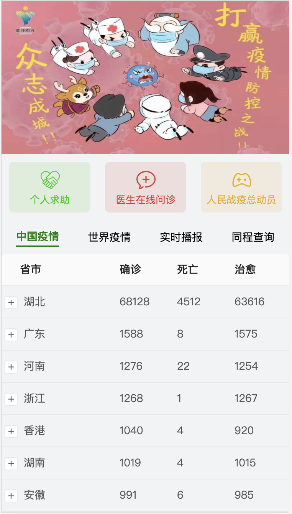
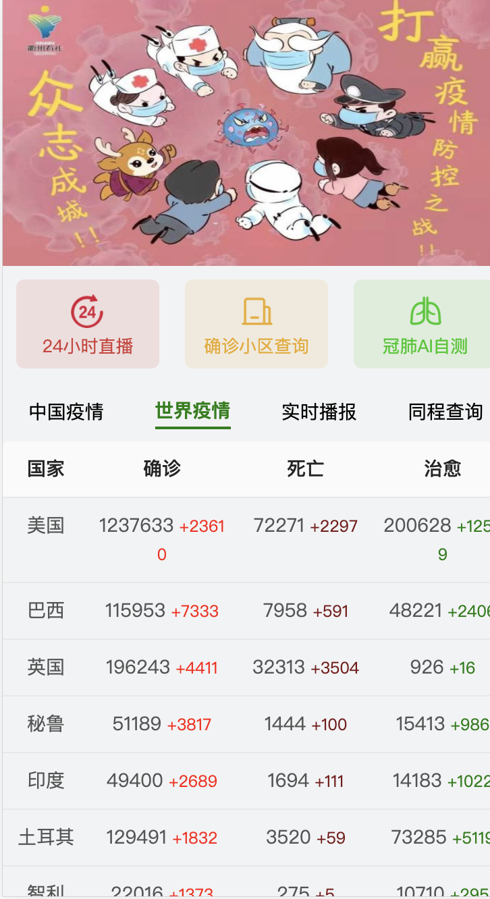
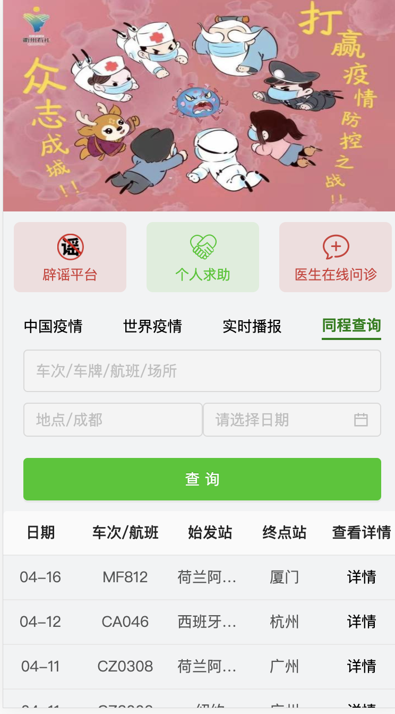

## 实时疫情图

**在线体验地址**：http://39.98.189.108/

**前端技术栈**：React hooks+redux+immutable+swiper+Axios

**后端技术栈**：express(为了跨域主要做中间件转发新浪数据请求),代码在前端nCovserver文件夹里的app.js，先no 						de app.js运行行后端文件，在前端文件。

### 功能图

**主页**

**世界疫情**

**实时播报**

**同程查询**

## 结语

祝各位健康平安，祖国繁荣富强，疫情早日过去!